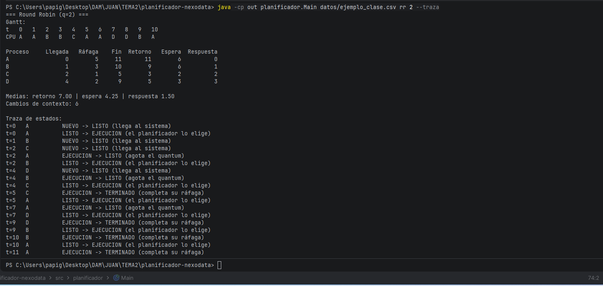
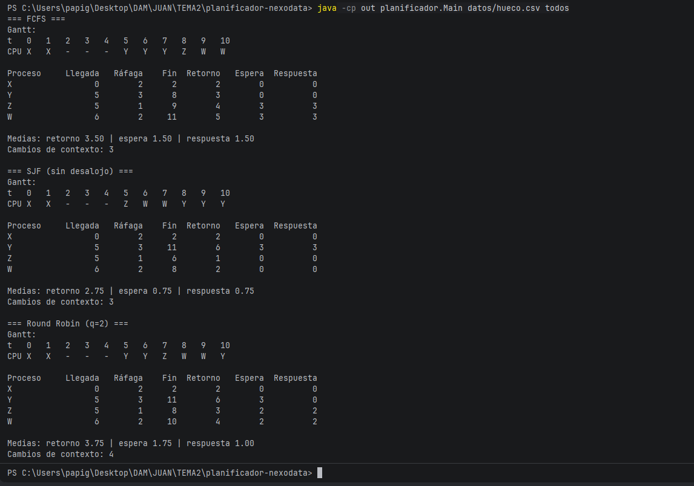
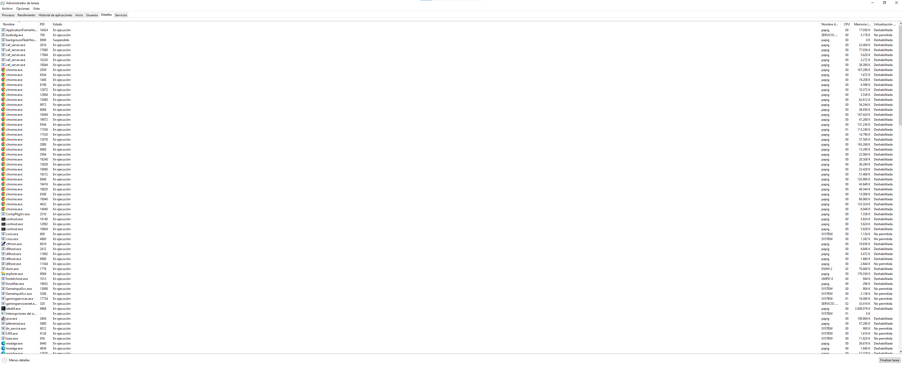

# Simulador de planificación · NexoData

> PSP · Tema 2 · Procesos · 2.º A DAM · **Juan [Tu apellido]**

## 1. Qué hace

Simulador de consola que lee un fichero de procesos con formato
`nombre;llegada;ráfaga`, los ejecuta con **FCFS**, **SJF sin desalojo** o
**Round Robin** (con quantum configurable) y muestra el diagrama de Gantt,
una tabla con fin/retorno/espera/respuesta por proceso y sus medias, el
número de cambios de contexto y, si se pasa `--traza`, la traza de estados
de cada transición. Sirve para comparar políticas de planificación antes
de decidir qué algoritmo usar en un servidor.

## 2. Cómo compilar y ejecutar

**Desde la terminal**, en la carpeta del proyecto:

```bash
javac -encoding UTF-8 -d out src/planificador/*.java
java -cp out planificador.Main datos/ejemplo_clase.csv rr 2 --traza
java -cp out planificador.Main datos/nocturno.csv todos 4
```

Uso general:

```
java planificador.Main <fichero.csv> <fcfs|sjf|rr|todos> [quantum] [--traza]
```

**Desde IntelliJ IDEA:** abrir la carpeta del proyecto, marcar `src` como
Sources Root, y crear una *Application* con Working directory = carpeta
del proyecto y Program arguments = `datos/ejemplo_clase.csv rr 2 --traza`.



## 3. Diseño

- **`EstadoProceso`** (enum): `NUEVO, LISTO, EJECUCION, BLOQUEADO, TERMINADO`.
  `BLOQUEADO` se declara por completitud del modelo pero no se usa: el
  simulador solo modela ráfagas de CPU, sin E/S.
- **`Proceso`**: datos inmutables (nombre, llegada, ráfaga, ordenLlegada) y
  estado de simulación (restante, estado, fin, primeraCPU). El método
  `reiniciar()` devuelve el proceso a su estado inicial para poder simular
  varios algoritmos seguidos con la misma lista sin arrastrar estado.
- **`LectorCSV`**: lee el fichero, ignora líneas vacías y comentarios, y
  valida cada línea (3 campos, llegada ≥ 0, ráfaga > 0).
- **`Resultado`**: contenedor que acumula el Gantt, la traza, el número de
  cambios de contexto y la lista de procesos terminados.
- **`Planificador`** (clase abstracta): contiene el **bucle único** de
  simulación, que respeta las 4 reglas del enunciado aplicando cada
  instante en este orden: (1) llegadas, (2) desalojo por quantum,
  (3) selección si CPU libre, (4) ejecución de una unidad. Se personaliza
  mediante tres métodos: `seleccionar()` (quién usa la CPU),
  `debeDesalojarPorQuantum()` (cuándo se le quita) y
  `debeRenovarQuantum()` (Regla 4). FCFS y SJF no desalojan nunca.
- **`Fcfs`, `Sjf`, `RoundRobin`**: implementaciones concretas que solo
  sobrescriben los métodos necesarios. Todo lo demás (avance del tiempo,
  métricas, trazas, Gantt) está reutilizado de la clase base, evitando
  repetir el bucle de simulación tres veces.
- **`Informe`**: formatea la salida por consola (Gantt, tabla, medias,
  traza).

## 4. Verificación (tarea 4)

### 4.1 `verificacion.csv` resuelto a mano

Procesos: `P1;0;6 · P2;1;4 · P3;2;2 · P4;4;5 · P5;6;1`

FCFS

Gantt: `P1 P1 P1 P1 P1 P1 | P2 P2 P2 P2 | P3 P3 | P4 P4 P4 P4 P4 | P5`

| Proceso | Llegada | Ráfaga | Fin | Retorno | Espera | Respuesta |
|---|---|---|---|---|---|---|
| P1 | 0 | 6 | 6 | 6 | 0 | 0 |
| P2 | 1 | 4 | 10 | 9 | 5 | 5 |
| P3 | 2 | 2 | 12 | 10 | 8 | 8 |
| P4 | 4 | 5 | 17 | 13 | 8 | 8 |
| P5 | 6 | 1 | 18 | 12 | 11 | 11 |

Medias: retorno 10.00, espera 6.40, respuesta 6.40.
Cambios de contexto: 4.

Round Robin q=2

Cola de listos antes de cada decisión (por orden):

| t | Cola antes de elegir | Elegido |
|---|---|---|
| 0 | [P1] | P1 |
| 2 | [P2, P3] (llega P3 antes del desalojo de P1, Regla 3) | P2 |
| 4 | [P3, P1, P4] (llega P4 antes del desalojo de P2) | P3 |
| 6 | [P1, P4, P2, P5] | P1 |
| 8 | [P4, P2, P5, P1] | P4 |
| 10 | [P2, P5, P1, P4] | P2 |
| 12 | [P5, P1, P4] | P5 |
| 13 | [P1, P4] | P1 |
| 15 | [P4] | P4 |
| 17 | [] → Regla 4: P4 renueva quantum sin desalojo | — |

Gantt: `P1 P1 P2 P2 P3 P3 P1 P1 P4 P4 P2 P2 P5 P1 P1 P4 P4 P4`

| Proceso | Llegada | Ráfaga | Fin | Retorno | Espera | Respuesta |
|---|---|---|---|---|---|---|
| P1 | 0 | 6 | 15 | 15 | 9 | 0 |
| P2 | 1 | 4 | 12 | 11 | 7 | 1 |
| P3 | 2 | 2 | 6 | 4 | 2 | 2 |
| P4 | 4 | 5 | 18 | 14 | 9 | 4 |
| P5 | 6 | 1 | 13 | 7 | 6 | 6 |

Medias: retorno 10.20, espera 6.60, respuesta 2.60.
Cambios de contexto: 8.

### 4.2 Comparación con el programa

Tras resolver el ejercicio a mano, ejecuté:

```
java -cp out planificador.Main datos/verificacion.csv fcfs
java -cp out planificador.Main datos/verificacion.csv rr 2 --traza
```

FCFS: coincide exactamente con mi resolución manual. Gantt
`P1 P1 P1 P1 P1 P1 P2 P2 P2 P2 P3 P3 P4 P4 P4 P4 P4 P5`, medias
retorno 10.00, espera 6.40, respuesta 6.40, cambios de contexto 4.

RR q=2: coincide exactamente con mi resolución manual. Gantt
`P1 P1 P2 P2 P3 P3 P1 P1 P4 P4 P2 P2 P5 P1 P1 P4 P4 P4`, medias
retorno 10.20, espera 6.60, respuesta 2.60, cambios de contexto 8.
Comprobé que se respeta la Regla 3: en t=2, P3 entra en la cola ANTES
de que P1 sea desalojado (visible en la traza). Y la Regla 4: cuando
un proceso agota el quantum y la cola está vacía, sigue en CPU con un
quantum nuevo, sin cambio de contexto.

### 4.3 `hueco.csv`

Entre los instantes t=2 y t= la CPU queda ociosa: X termina en t=2
y los siguientes procesos (Y, Z) no llegan hasta t=5. El diagrama lo
refleja con tres casillas `-` consecutivas (`[2,3)`, `[3,4)`, `[4,5)`).
Además, en t=5 llegan Y y Z simultáneamente: por la Regla 2 entra antes
Y (aparece primero en el fichero).



## 5. Análisis y recomendación a NexoData (tarea 5)

| nocturno.csv | Retorno medio | Espera media | Respuesta media | Cambios de contexto |
|---|---|---|---|---|
| FCFS | 14.00 | 10.00 | 10.00 | 5 |
| SJF | 11.67 | 7.67 | 7.67 | 5 |
| RR q=1 | 12.33 | 8.33 | 1.50| 22 |
| RR q=2 | 12.17 | 8.17 | 2.83 | 11 |
| RR q=4 | 14.50 | 10.50 | 6.17 | 8 |

1. SJF da la menor espera media (7.67). Pasa antes los trabajos cortos
   (LOGS=1, INFORME=2, AVISOS=2) y deja para el final los largos
   (BACKUP=6, RUTAS=4). Como esos cortos no esperan detrás de FACTURA, su
   espera cae en picado y tira de la media hacia abajo.

2. En FCFS, LOGS espera 14 minutos. LOGS solo necesita 1 minuto pero
   llega en t=3, cuando FACTURA (ráfaga 9) aún está en CPU y BACKUP
   (ráfaga 6) espera en cola. Efecto convoy: un trabajo muy largo
   bloquea la CPU y todos los que llegan detrás heredan su penalización
   en cadena. El proceso culpable es FACTURA.

3. En SJF el peor parado es BACKUP (espera 16, retorno 22). Si cada
   pocos minutos llegasen trabajos cortos nuevos, BACKUP nunca llegaría
   a ejecutarse: eso es inanición (starvation)**. Se evita con
   envejecimiento (aging): subir progresivamente la prioridad de los
   procesos que llevan mucho en cola.

4. Al bajar el quantum de 4 a 1, la respuesta media cae de 6.17 a 1.50
   (mejora enorme para el usuario interactivo) pero los cambios de
   contexto se disparan de 8 a 22. Un quantum de 1 minuto no sería
   realista en un SO real porque el cambio de contexto tiene coste: con
   quantum de 1 ms el sistema pasaría más tiempo cambiando de proceso
   que ejecutando.

5. RR q=4 (10.50) sale ligeramente peor que FCFS (10.00) en espera
   media. Sorprende, pero tiene sentido: RR reparte la penalización entre
   todos, así que FACTURA (que en FCFS esperaba 0) ahora espera 15. Los
   cortos mejoran algo, pero no lo suficiente para compensar. FCFS es
   mejor en media cuando los largos van primero; RR gana en el peor caso.

6. El simulador nunca usa Bloqueado porque solo modela ráfagas de
   CPU puras, sin E/S. En un SO real (`Administrador de tareas →
   Detalles` en Windows) aparecen estados como *Running* (equivalente a
   mi LISTO+EJECUCION), Suspended (equivalente a mi BLOQUEADO, no
   simulado) y Stopped. Mi modelo es un subconjunto simplificado: solo
   me interesa el reparto de CPU, no el ciclo completo de vida de un
   proceso con E/S.



### Recomendación

Para los trabajos nocturnos por lotes de NexoData usaría SJF con
envejecimiento: da la menor espera media (7.67) y la menor media de
retorno (11.67), y el envejecimiento evita que BACKUP se quede sin
ejecutar cuando lleguen trabajos cortos nuevos. Si el servidor tuviera
usuarios conectados (interactivos), cambiaría a Round Robin con
quantum ≈ 4 o al CFS de Linux: sacrifica algo de espera media pero
reduce la respuesta media a unos pocos minutos, que es lo que percibe
el usuario.